# WoTEx documentation

WoTEx separates a Thing Description, interaction planning, protocol execution
and application-owned effects. This index follows that path from discovery
to a device and back, then points to the normative contracts and evidence for
each package.

The diagrams describe responsibility and data flow. They do not turn a package
name into a claim of complete protocol support, interoperability or
certification. Each protocol section states its current boundary and links to
the package specification and completion plan.

## The complete Thing interaction path

A consumer may obtain a Thing Description directly or through
`wotex-directory`. Core validates it, Runtime selects a compatible Form, and a
binding or protocol package maps the interaction. The consumer still owns
credentials, authorization, transport policy, supervision, canonical state and
proof of physical effects.

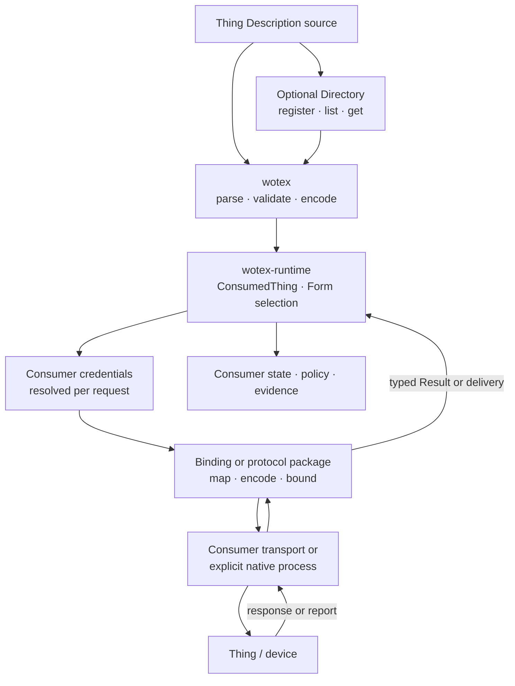
```mermaid
flowchart TD
  source["Thing Description source"] --> directory["Optional Directory<br/>register · list · get"]
  source --> core["wotex<br/>parse · validate · encode"]
  directory --> core
  core --> runtime["wotex-runtime<br/>ConsumedThing · Form selection"]
  runtime --> credentials["Consumer credentials<br/>resolved per request"]
  credentials --> adapter["Binding or protocol package<br/>map · encode · bound"]
  adapter --> transport["Consumer transport or<br/>explicit native process"]
  transport --> thing["Thing / device"]
  thing -->|response or report| transport
  transport --> adapter
  adapter -->|typed Result or delivery| runtime
  runtime --> state["Consumer state · policy · evidence"]
```

For a closed-loop solution, returned observations can cross an edge/cloud
boundary or enter a numerical pipeline. Neither path authorizes a new device
effect: an Action proposal or intent must return through consumer policy before
Runtime is called again.

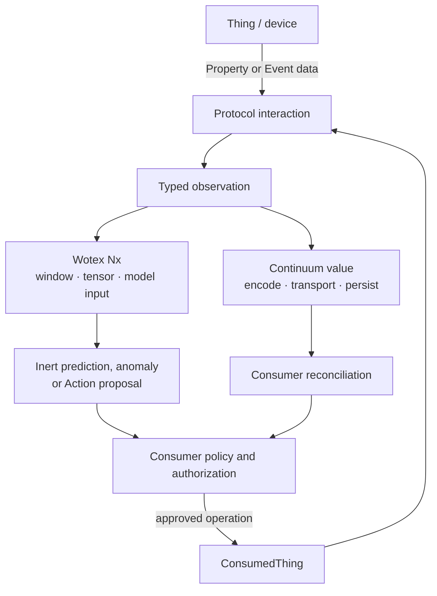
```mermaid
flowchart TD
  thing["Thing / device"] -->|Property or Event data| interaction["Protocol interaction"]
  interaction --> observation["Typed observation"]
  observation --> continuum["Continuum value<br/>encode · transport · persist"]
  observation --> nx["Wotex Nx<br/>window · tensor · model input"]
  nx --> proposal["Inert prediction, anomaly<br/>or Action proposal"]
  continuum --> reconcile["Consumer reconciliation"]
  proposal --> policy["Consumer policy and authorization"]
  reconcile --> policy
  policy -->|approved operation| runtime["ConsumedThing"]
  runtime --> interaction
```

## Runtime interaction flows

### Finite Property and Action operations

Runtime selects a Form and binding profile deterministically. Credential
material is resolved immediately before the transport call and is not retained
in the Thing Description, request, result or public error.

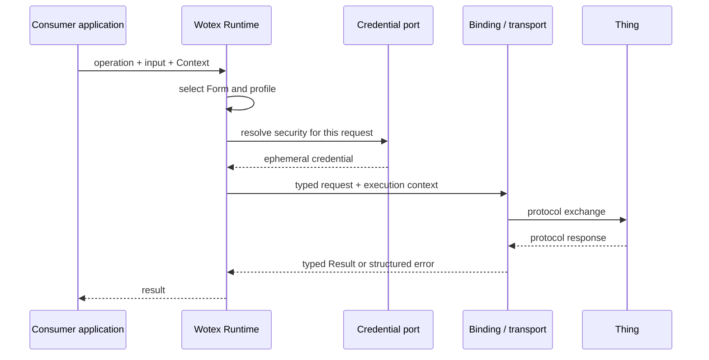
```mermaid
sequenceDiagram
  participant App as Consumer application
  participant Runtime as Wotex Runtime
  participant Creds as Credential port
  participant Transport as Binding / transport
  participant Thing as Thing
  App->>Runtime: operation + input + Context
  Runtime->>Runtime: select Form and profile
  Runtime->>Creds: resolve security for this request
  Creds-->>Runtime: ephemeral credential
  Runtime->>Transport: typed request + execution context
  Transport->>Thing: protocol exchange
  Thing-->>Transport: protocol response
  Transport-->>Runtime: typed Result or structured error
  Runtime-->>App: result
```

Form selection proves compatibility, not authorization. A successful write or
Action acknowledgement proves a protocol exchange, not canonical state or a
physical effect.

### Property observations and Event subscriptions

Runtime returns an OTP child specification rather than starting work. The
consumer chooses the supervisor, receiver, restart policy and queue bounds.

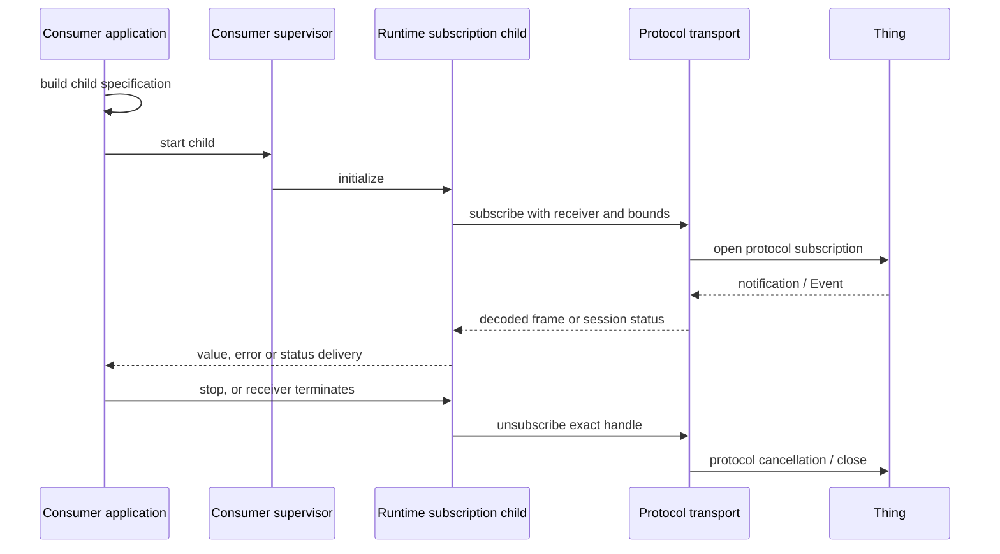
```mermaid
sequenceDiagram
  participant App as Consumer application
  participant Sup as Consumer supervisor
  participant Sub as Runtime subscription child
  participant Transport as Protocol transport
  participant Thing as Thing
  App->>App: build child specification
  App->>Sup: start child
  Sup->>Sub: initialize
  Sub->>Transport: subscribe with receiver and bounds
  Transport->>Thing: open protocol subscription
  Thing-->>Transport: notification / Event
  Transport-->>Sub: decoded frame or session status
  Sub-->>App: value, error or status delivery
  App->>Sub: stop, or receiver terminates
  Sub->>Transport: unsubscribe exact handle
  Transport->>Thing: protocol cancellation / close
```

### ExposedThing inbound dispatch

`ExposedThing` dispatches an admitted operation to a registered handler. The
consumer supplies the listener and must validate the inbound binding and data,
authenticate and authorize the caller, and decide how handler results affect
canonical state.

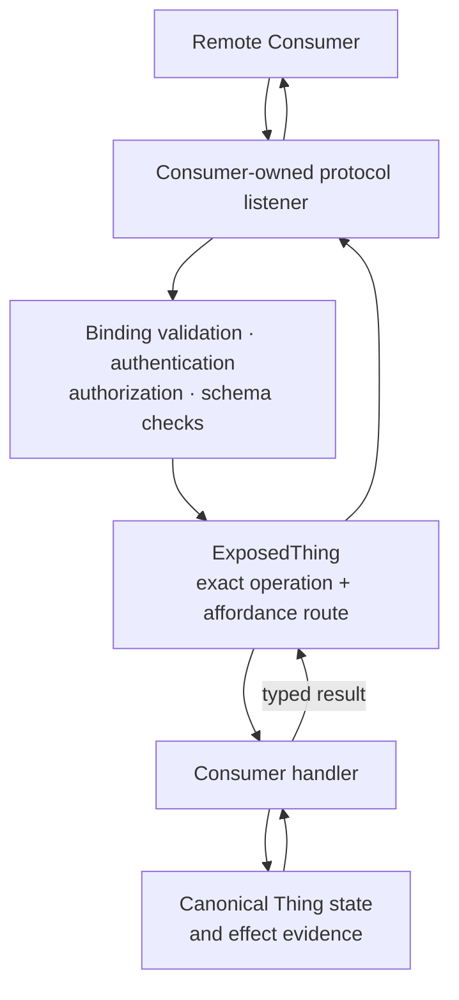
```mermaid
flowchart TD
  peer["Remote Consumer"] --> listener["Consumer-owned protocol listener"]
  listener --> admission["Binding validation · authentication<br/>authorization · schema checks"]
  admission --> exposed["ExposedThing<br/>exact operation + affordance route"]
  exposed --> handler["Consumer handler"]
  handler --> state["Canonical Thing state<br/>and effect evidence"]
  state --> handler
  handler -->|typed result| exposed
  exposed --> listener
  listener --> peer
```

See the [Runtime README](../packages/wotex-runtime/README.md) and
[Runtime specification](packages/wotex-runtime/specs/WRT.01-consumed-thing-runtime.md)
for the complete operation and ownership contracts.

## Protocol device paths

### HTTP and Server-Sent Events

The HTTP binding maps Forms to immutable requests. A consumer-supplied client
owns DNS, sockets, TLS, redirects, connection pooling and destination policy.
Finite Property and Action operations use HTTP responses; Property observations
and Event subscriptions use client-parsed SSE frames.

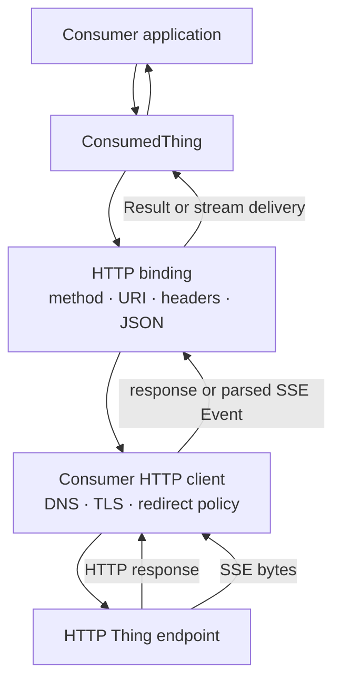
```mermaid
flowchart TD
  app["Consumer application"] --> runtime["ConsumedThing"]
  runtime --> binding["HTTP binding<br/>method · URI · headers · JSON"]
  binding --> client["Consumer HTTP client<br/>DNS · TLS · redirect policy"]
  client --> endpoint["HTTP Thing endpoint"]
  endpoint -->|HTTP response| client
  endpoint -->|SSE bytes| client
  client -->|response or parsed SSE Event| binding
  binding -->|Result or stream delivery| runtime
  runtime --> app
```

Current operations are Property read/write, Action invoke/query/cancel, Property
observation and Event subscription. Stream close calls the client port; it does
not invent a hidden HTTP request. Aggregate interactions are outside the current
mapping.

[Package README](../packages/wotex-binding-http/README.md) ·
[operation inventory](packages/wotex-binding-http/http-operation-inventory.md) ·
[transport specification](packages/wotex-binding-http/specs/WBH.01-http-transport.md) ·
[security](packages/wotex-binding-http/security.md) ·
[completion plan](packages/wotex-binding-http/plans/wotex-binding-http-completion.md)

### MQTT

The MQTT binding turns Forms into publish, retained-read, subscribe and
unsubscribe commands. The consumer owns the broker connection, TLS, session,
reconnect and back-pressure policy.

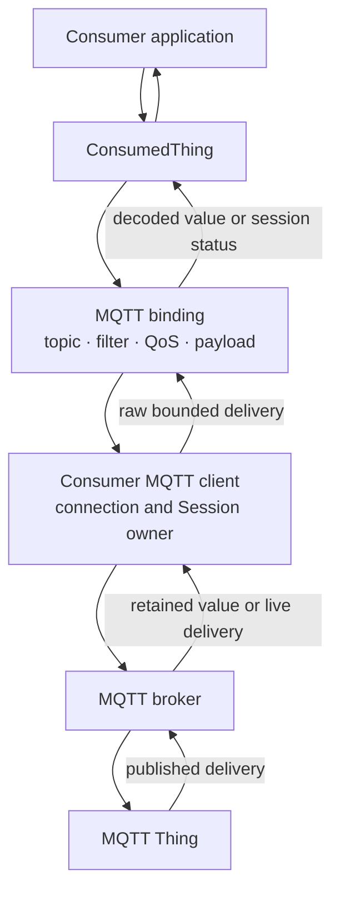
```mermaid
flowchart TD
  app["Consumer application"] --> runtime["ConsumedThing"]
  runtime --> binding["MQTT binding<br/>topic · filter · QoS · payload"]
  binding --> client["Consumer MQTT client<br/>connection and Session owner"]
  client --> broker["MQTT broker"]
  broker --> device["MQTT Thing"]
  device -->|published delivery| broker
  broker -->|retained value or live delivery| client
  client -->|raw bounded delivery| binding
  binding -->|decoded value or session status| runtime
  runtime --> app
```

Property writes and Action invocations publish to a Topic Name. Property reads
wait for one retained delivery. Observations and Events use Topic Filters and a
Runtime subscription child. A lost MQTT Session stops that child so consumer
supervision can decide whether to restart and resubscribe.

[Package README](../packages/wotex-binding-mqtt/README.md) ·
[Form mapping](packages/wotex-binding-mqtt/specs/WBM.02-form-mapping.md) ·
[Runtime transport](packages/wotex-binding-mqtt/specs/WBM.03-runtime-transport.md) ·
[security](packages/wotex-binding-mqtt/security.md) ·
[completion plan](packages/wotex-binding-mqtt/plans/wotex-binding-mqtt-completion.md)

### BACnet/IP

BACnet maps Property addresses and native values onto an owned IPv4 stack or an
explicitly borrowed BACstack client. Runtime reads and writes use the native
profile; the `:ip_cov` profile adds Change of Value observation.

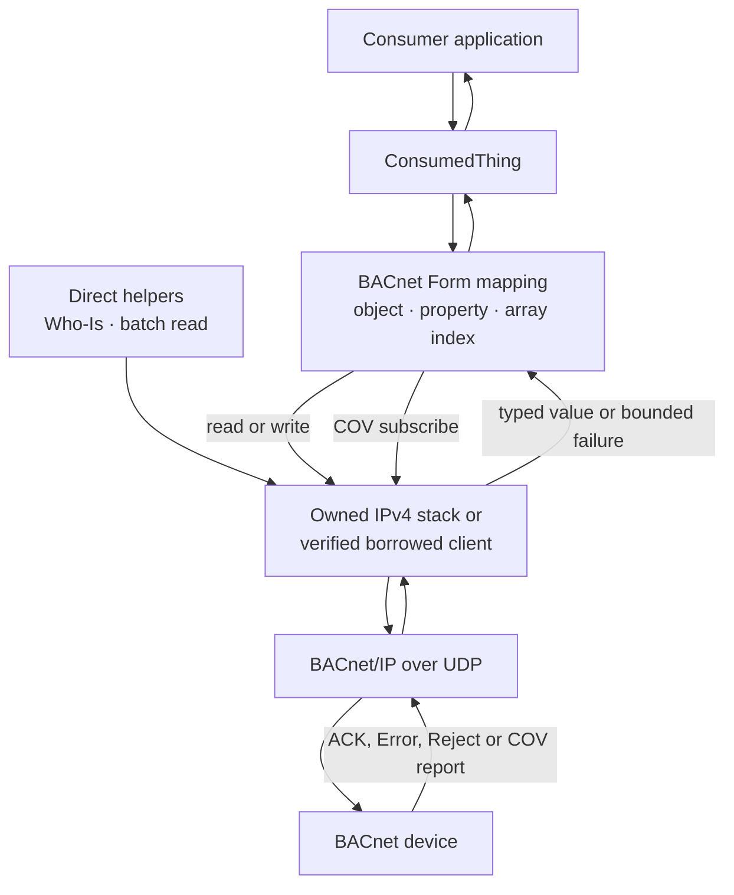
```mermaid
flowchart TD
  app["Consumer application"] --> runtime["ConsumedThing"]
  runtime --> mapping["BACnet Form mapping<br/>object · property · array index"]
  direct["Direct helpers<br/>Who-Is · batch read"] --> client
  mapping -->|read or write| client["Owned IPv4 stack or<br/>verified borrowed client"]
  mapping -->|COV subscribe| client
  client --> udp["BACnet/IP over UDP"]
  udp --> device["BACnet device"]
  device -->|ACK, Error, Reject or COV report| udp
  udp --> client
  client -->|typed value or bounded failure| mapping
  mapping --> runtime
  runtime --> app
```

The current path supports ReadProperty, WriteProperty, bounded discovery,
sequential batch reads and finite COV subscriptions. Routing/BBMD, MS/TP and
BACnet/SC are not supported.

[Package README](../packages/wotex-bacnet/README.md) ·
[implemented profile](packages/wotex-bacnet/specs/WBA.03-implemented-profile.md) ·
[security](packages/wotex-bacnet/security.md) ·
[evidence](packages/wotex-bacnet/provenance/executable-evidence.md) ·
[completion plan](packages/wotex-bacnet/plans/software-implementation.md)

### Bluetooth Low Energy

BLE reaches GATT through BlueZ. One-shot access invokes a supplied `busctl` for
an already connected characteristic; the persistent path uses a verified,
guarded C++ host with one D-Bus sender.

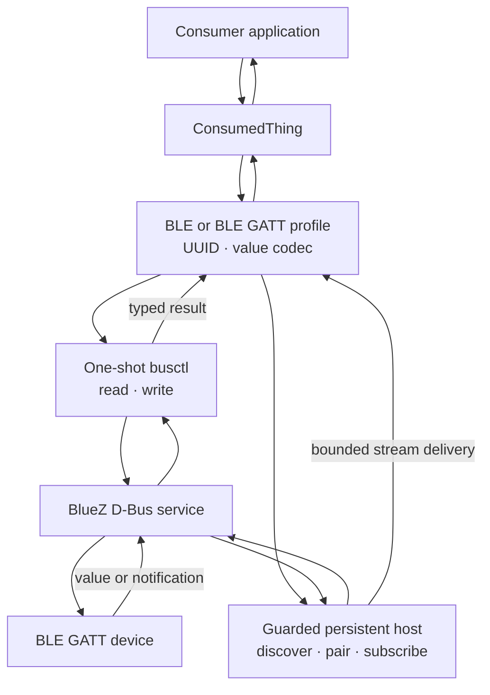
```mermaid
flowchart TD
  app["Consumer application"] --> runtime["ConsumedThing"]
  runtime --> profile["BLE or BLE GATT profile<br/>UUID · value codec"]
  profile --> oneshot["One-shot busctl<br/>read · write"]
  profile --> persistent["Guarded persistent host<br/>discover · pair · subscribe"]
  oneshot --> bluez["BlueZ D-Bus service"]
  persistent --> bluez
  bluez --> device["BLE GATT device"]
  device -->|value or notification| bluez
  bluez --> oneshot
  bluez --> persistent
  persistent -->|bounded stream delivery| profile
  oneshot -->|typed result| profile
  profile --> runtime
  runtime --> app
```

The basic Runtime profile supports Property reads and writes. The GATT profile
adds Property observation and Event subscription through the persistent
backend. Pairing requires an explicit consumer Agent decision; WoTEx does not
start BlueZ, power an adapter or infer security from a paired flag.

[Package README](../packages/wotex-ble/README.md) ·
[implemented profile](packages/wotex-ble/specs/WBL.03-implemented-profile.md) ·
[native backend](packages/wotex-ble/specs/WBL.07-native-backend.md) ·
[security](packages/wotex-ble/security.md) ·
[evidence](packages/wotex-ble/provenance/executable-evidence.md) ·
[completion plan](packages/wotex-ble/plans/software-implementation.md)

### CoAP, DTLS and OSCORE

CoAP maps Forms onto bounded request/response exchanges and Observe streams.
The selected profile determines whether the path uses UDP, DTLS 1.2 or an
explicit native OSCORE owner.

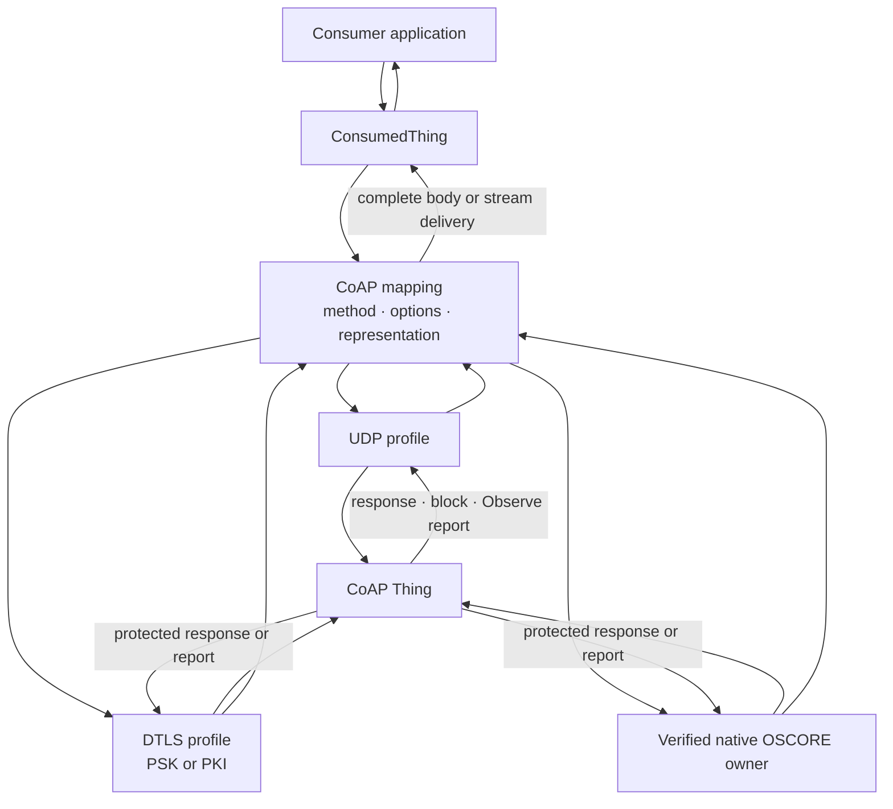
```mermaid
flowchart TD
  app["Consumer application"] --> runtime["ConsumedThing"]
  runtime --> mapping["CoAP mapping<br/>method · options · representation"]
  mapping --> udp["UDP profile"]
  mapping --> dtls["DTLS profile<br/>PSK or PKI"]
  mapping --> oscore["Verified native OSCORE owner"]
  udp --> device["CoAP Thing"]
  dtls --> device
  oscore --> device
  device -->|response · block · Observe report| udp
  device -->|protected response or report| dtls
  device -->|protected response or report| oscore
  udp --> mapping
  dtls --> mapping
  oscore --> mapping
  mapping -->|complete body or stream delivery| runtime
  runtime --> app
```

The current path includes bounded confirmable/non-confirmable exchange,
Block1/Block2 bodies, discovery and Observe renewal/cancellation. Numeric IP
destinations are required; multicast and extended tokens are outside the
implemented profile. The OSCORE flow is explicit and native; remaining
independent interoperability work is tracked in its plan.

[Package README](../packages/wotex-coap/README.md) ·
[implemented profile](packages/wotex-coap/specs/WCO.03-implemented-profile.md) ·
[blockwise contract](packages/wotex-coap/specs/WCO.04-blockwise.md) ·
[security](packages/wotex-coap/security.md) ·
[evidence](packages/wotex-coap/provenance/executable-evidence.md) ·
[completion plan](packages/wotex-coap/plans/software-implementation.md)

### Matter

Matter uses an explicitly built connectedhomeip controller process. The
persistent controller owns durable fabric authority, attestation, CASE
sessions, commissioning and subscriptions; one-shot operations reopen an
existing controller store for a finite interaction.

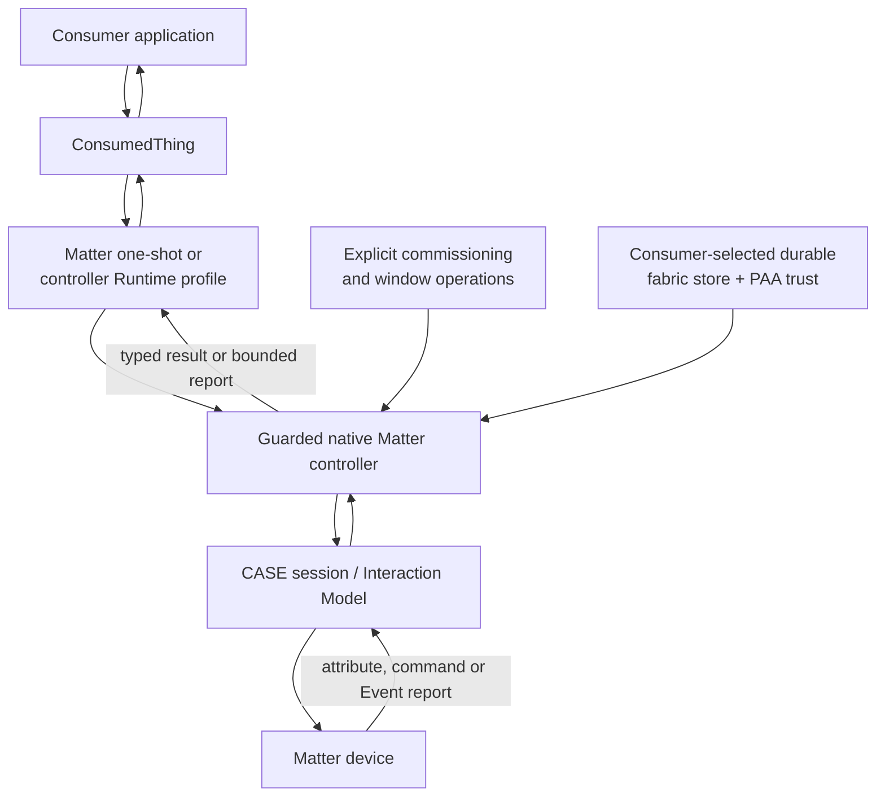
```mermaid
flowchart TD
  app["Consumer application"] --> runtime["ConsumedThing"]
  runtime --> profile["Matter one-shot or<br/>controller Runtime profile"]
  admin["Explicit commissioning<br/>and window operations"] --> controller
  profile --> controller["Guarded native Matter controller"]
  store["Consumer-selected durable<br/>fabric store + PAA trust"] --> controller
  controller --> case["CASE session / Interaction Model"]
  case --> device["Matter device"]
  device -->|attribute, command or Event report| case
  case --> controller
  controller -->|typed result or bounded report| profile
  profile --> runtime
  runtime --> app
```

The controller path supports concrete and batch reads, writes, invokes,
attribute/Event subscriptions and explicit on-network commissioning. Recovery
reports continuity loss instead of claiming gap-free replay. Commissioning and
failed writes/invokes are never retried automatically because their effect may
be unknown.

[Package README](../packages/wotex-matter/README.md) ·
[implemented profile](packages/wotex-matter/specs/WMA.03-implemented-profile.md) ·
[native backend](packages/wotex-matter/specs/WMA.08-native-backend.md) ·
[security](packages/wotex-matter/security.md) ·
[evidence](packages/wotex-matter/provenance/executable-evidence.md) ·
[completion plan](packages/wotex-matter/plans/software-implementation.md)

### Modbus TCP

Modbus maps Forms to strict MBAP transactions over one owned TCP connection.
The connection serializes requests and validates transaction, Unit Identifier,
function and response shape before returning a value.

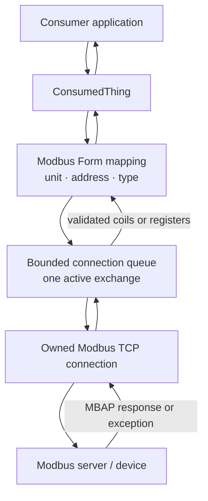
```mermaid
flowchart TD
  app["Consumer application"] --> runtime["ConsumedThing"]
  runtime --> mapping["Modbus Form mapping<br/>unit · address · type"]
  mapping --> queue["Bounded connection queue<br/>one active exchange"]
  queue --> tcp["Owned Modbus TCP connection"]
  tcp --> device["Modbus server / device"]
  device -->|MBAP response or exception| tcp
  tcp --> queue
  queue -->|validated coils or registers| mapping
  mapping --> runtime
  runtime --> app
```

The current profile covers functions 1, 2, 3, 4, 5, 6, 15 and 16. It does not
provide RTU/serial, Modbus Security or built-in polling. A transmitted write
whose response is lost has an unknown effect and is not classified as
retryable.

[Package README](../packages/wotex-modbus/README.md) ·
[protocol contract](packages/wotex-modbus/specs/WMB.02-protocol.md) ·
[Form profile](packages/wotex-modbus/specs/WMB.03-form-profile.md) ·
[security](packages/wotex-modbus/security.md) ·
[evidence](packages/wotex-modbus/provenance/executable-evidence.md) ·
[completion plan](packages/wotex-modbus/plans/software-implementation.md)

### OPC UA

OPC UA uses an explicitly owned open62541 executable for secure Sessions and
typed services. The direct native API is broader than the current Runtime Form
mapping, so the two entrances remain visible in the flow.

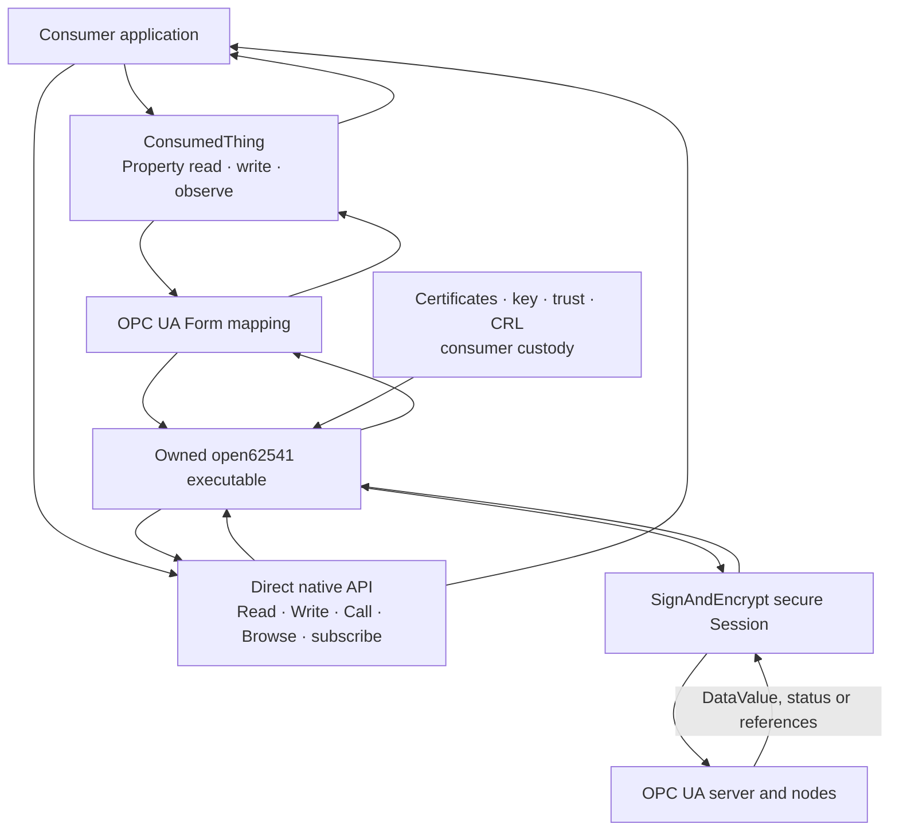
```mermaid
flowchart TD
  app["Consumer application"] --> runtime["ConsumedThing<br/>Property read · write · observe"]
  app --> direct["Direct native API<br/>Read · Write · Call · Browse · subscribe"]
  runtime --> mapping["OPC UA Form mapping"]
  mapping --> owner["Owned open62541 executable"]
  direct --> owner
  custody["Certificates · key · trust · CRL<br/>consumer custody"] --> owner
  owner --> session["SignAndEncrypt secure Session"]
  session --> server["OPC UA server and nodes"]
  server -->|DataValue, status or references| session
  session --> owner
  owner --> mapping
  owner --> direct
  mapping --> runtime
  runtime --> app
  direct --> app
```

The one-shot Runtime profile maps Property reads and writes; the persistent
session profile adds Property observation and exact unsubscription. Native
Browse and Call are not exposed as Runtime Action or aggregate operations, and
Event subscription is unsupported. Broader Runtime integration and lifecycle
coverage remain partial. The accepted security path requires explicit
certificate material, server pinning, direct CA trust and a current CRL.

[Package README](../packages/wotex-opcua/README.md) ·
[implemented profile](packages/wotex-opcua/specs/WOP.03-implemented-profile.md) ·
[native executable](packages/wotex-opcua/specs/WOP.07-native-executable.md) ·
[security](packages/wotex-opcua/security.md) ·
[evidence](packages/wotex-opcua/provenance/executable-evidence.md) ·
[completion plan](packages/wotex-opcua/plans/software-implementation.md)

### Thread and OpenThread

Thread is a network inspection and management path, not a generic application
Property transport. The read-only daemon adapter inspects an existing
`ot-daemon`; the explicit OpenThread adapter owns its native host, SDK instance,
radio children, interface and settings lock.

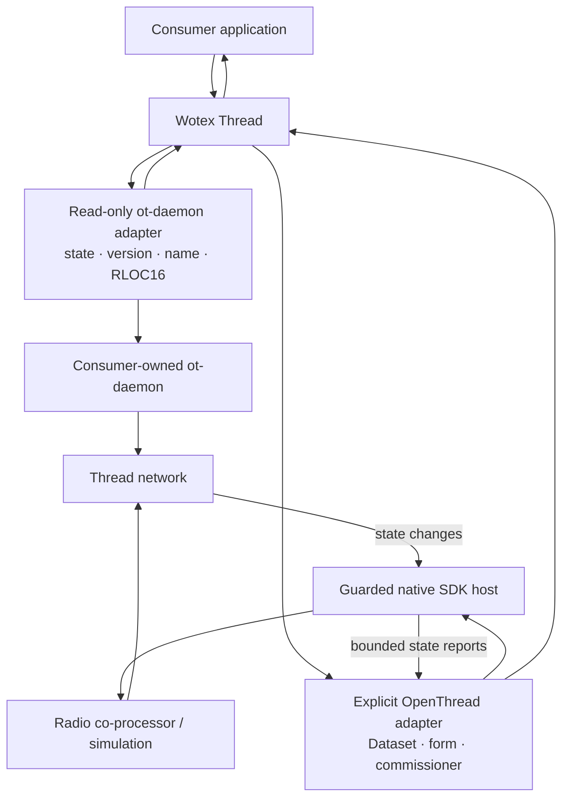
```mermaid
flowchart TD
  app["Consumer application"] --> thread["Wotex Thread"]
  thread --> daemon["Read-only ot-daemon adapter<br/>state · version · name · RLOC16"]
  thread --> sdk["Explicit OpenThread adapter<br/>Dataset · form · commissioner"]
  daemon --> otd["Consumer-owned ot-daemon"]
  sdk --> host["Guarded native SDK host"]
  host --> rcp["Radio co-processor / simulation"]
  otd --> network["Thread network"]
  rcp --> network
  network -->|state changes| host
  host -->|bounded state reports| sdk
  sdk --> thread
  daemon --> thread
  thread --> app
```

The implemented management path validates and exports Operational Datasets,
enables IPv6 and Thread, forms an explicitly permitted network, submits
management updates and controls finite commissioner admissions. Joiner
execution, border-router management and physical-radio interoperability remain
outside the current accepted profile.

[Package README](../packages/wotex-thread/README.md) ·
[implemented profile](packages/wotex-thread/specs/WTH.03-implemented-profile.md) ·
[native backend](packages/wotex-thread/specs/WTH.07-native-backend.md) ·
[security](packages/wotex-thread/security.md) ·
[evidence](packages/wotex-thread/provenance/executable-evidence.md) ·
[completion plan](packages/wotex-thread/plans/software-implementation.md)

## Supporting solution flows

### Thing Description Directory

Directory mechanics are storage-neutral. The consumer supplies repository,
authorization, clock and identifier ports; the library owns validation,
ordering, optimistic concurrency, bounded listing and normalized errors.

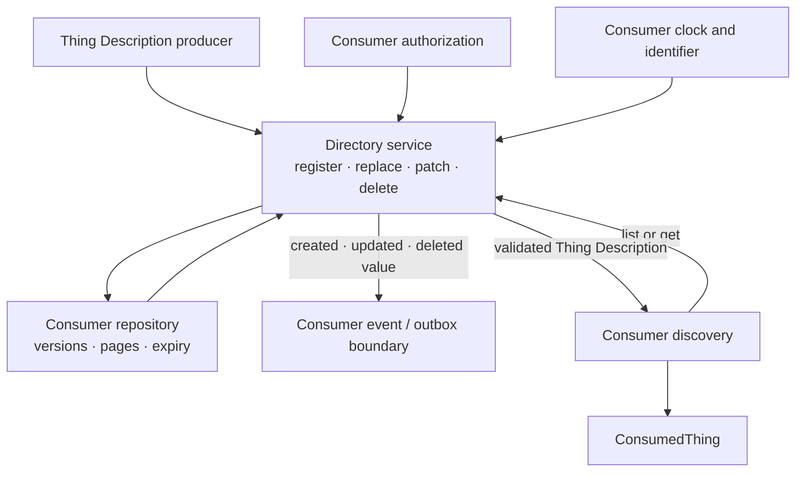
```mermaid
flowchart TD
  producer["Thing Description producer"] --> service["Directory service<br/>register · replace · patch · delete"]
  policy["Consumer authorization"] --> service
  clock["Consumer clock and identifier"] --> service
  service --> repository["Consumer repository<br/>versions · pages · expiry"]
  repository --> service
  service -->|created · updated · deleted value| outbox["Consumer event / outbox boundary"]
  discoverer["Consumer discovery"] -->|list or get| service
  service -->|validated Thing Description| discoverer
  discoverer --> runtime["ConsumedThing"]
```

[Package README](../packages/wotex-directory/README.md) ·
[Directory specification](packages/wotex-directory/specs/WTD.01-directory-contract.md) ·
[security](packages/wotex-directory/security.md)

### Edge/cloud exchange, numerical work and evidence

Continuum values carry replayable observations, Action intents/results,
delivery and lifecycle data without selecting a transport or database. Wotex Nx
turns typed observations into deterministic batches and decodes only inert
outputs. Conformance executes immutable vectors against an external subject and
records a claim-scoped report. Lab composes these seams into consumer-owned
scenarios.

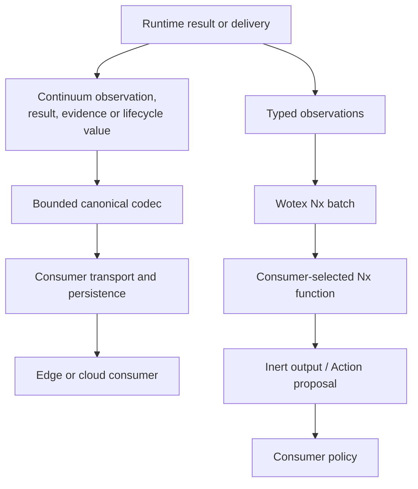
```mermaid
flowchart TD
  result["Runtime result or delivery"] --> values["Continuum observation,<br/>result, evidence or lifecycle value"]
  values --> codec["Bounded canonical codec"]
  codec --> transport["Consumer transport and persistence"]
  transport --> remote["Edge or cloud consumer"]
  result --> observations["Typed observations"]
  observations --> batch["Wotex Nx batch"]
  batch --> model["Consumer-selected Nx function"]
  model --> inert["Inert output / Action proposal"]
  inert --> policy["Consumer policy"]
```

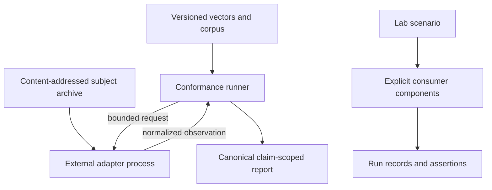
```mermaid
flowchart TD
  corpus["Versioned vectors and corpus"] --> runner["Conformance runner"]
  archive["Content-addressed subject archive"] --> adapter["External adapter process"]
  runner -->|bounded request| adapter
  adapter -->|normalized observation| runner
  runner --> report["Canonical claim-scoped report"]
  scenario["Lab scenario"] --> components["Explicit consumer components"]
  components --> evidence["Run records and assertions"]
```

[Continuum README](../packages/wotex-continuum/README.md) ·
[Nx README](../packages/wotex-nx/README.md) ·
[Conformance README](../packages/wotex-conformance/README.md) ·
[Lab README](../packages/wotex-lab/README.md)

## Package documentation

Each package documentation tree uses a unique specification prefix:

- [`wotex` — `WTX`](../packages/wotex/README.md) owns Thing Description and Thing Model values.
- [`wotex-runtime` — `WRT`](../packages/wotex-runtime/README.md) owns portable interaction planning.
- [`wotex-directory` — `WTD`](../packages/wotex-directory/README.md) owns Directory mechanics.
- [`wotex-continuum` — `WCT`](../packages/wotex-continuum/README.md) owns edge/cloud exchange values.
- [`wotex-nx` — `WNX`](../packages/wotex-nx/README.md) owns deterministic numerical boundaries.
- [`wotex-binding-http` — `WBH`](../packages/wotex-binding-http/README.md) owns HTTP and SSE mapping.
- [`wotex-binding-mqtt` — `WBM`](../packages/wotex-binding-mqtt/README.md) owns MQTT mapping.
- [`wotex-bacnet` — `WBA`](../packages/wotex-bacnet/README.md) owns BACnet interactions.
- [`wotex-ble` — `WBL`](../packages/wotex-ble/README.md) owns Bluetooth Low Energy interactions.
- [`wotex-coap` — `WCO`](../packages/wotex-coap/README.md) owns CoAP interactions.
- [`wotex-matter` — `WMA`](../packages/wotex-matter/README.md) owns Matter interactions.
- [`wotex-modbus` — `WMB`](../packages/wotex-modbus/README.md) owns Modbus interactions.
- [`wotex-opcua` — `WOP`](../packages/wotex-opcua/README.md) owns OPC UA interactions.
- [`wotex-thread` — `WTH`](../packages/wotex-thread/README.md) owns Thread inspection and SDK management.
- [`wotex-conformance` — `WCF`](../packages/wotex-conformance/README.md) owns conformance evidence.
- [`wotex-lab` — `WLB`](../packages/wotex-lab/README.md) owns consumer scenarios and experiments.

A specification identifier is unique across the family; its prefix names the
owning package.

## How the documentation tree works

Long-form family documentation lives under `docs/`. Package READMEs and the
concise `usage-rules.md` files for completed package contracts live beside
package code.
Code never reads from the documentation tree, except for wotex-lab's documented
development-only knowledge graph and MCP resources, which read it as their
subject through `Wotex.Lab.Documentation`.

- `packages/<name>/specs/` contains normative package specifications and the
  `catalogue.yaml` that owns each specification's `implementation_status`.
- `packages/<name>/plans/` contains the versioned completion contract.
- `packages/<name>/decisions/` contains package-level decisions.
- `packages/<name>/provenance/` contains pinned sources and executable evidence.
- `packages/<name>/security.md` records the package security posture.
- `architecture/` records family dependencies and ownership boundaries.
- `guides/` contains cross-package consumer, development and release guidance.
- `packages/<name>/usage-rules.md`, outside this tree, contains consumer-facing
  rules collected from installed dependencies by the `usage_rules` Mix tool.
- `tasks/local/<name>/` is ignored machine-local execution state; it is never
  tracked or published.
- `catalogue.yaml` is generated from package catalogues by
  `mix wotex.catalogue` and must not be edited by hand.

Inside `packages/<name>/specs/catalogue.yaml`, a path beginning with `docs/` is
relative to `docs/packages/<name>/`. Every other path is relative to the source
package at `packages/<name>/`.

## Family documents

- [Package graph and ownership boundaries](architecture/package-graph.md)
- [Consuming WoTEx packages](guides/consumer.md)
- [Development workflow](guides/development.md)
- [Releasing a package](guides/release.md)
- [Generated family catalogue](catalogue.yaml)
