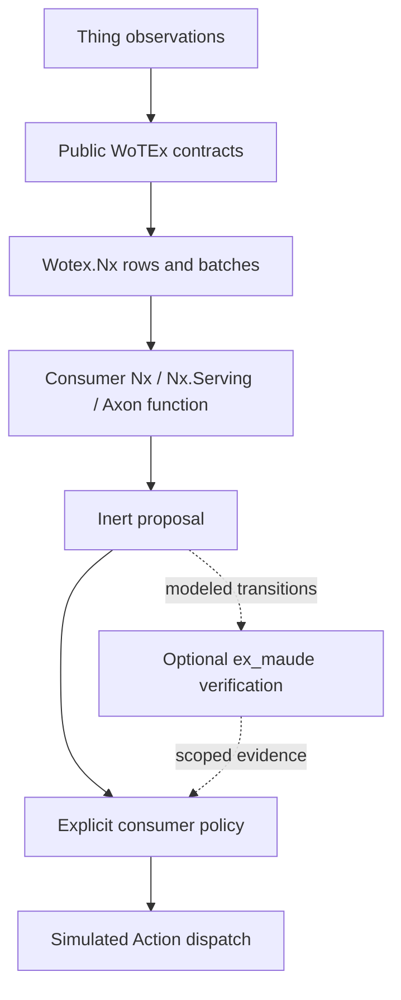

# Wotex Lab

**A consumer laboratory for connected Things and numerical experiments in Elixir and OTP.**

[](https://hex.pm/packages/wotex_lab)
[](https://hexdocs.pm/wotex_lab)
[](https://github.com/wotex-project/wotex-lab/actions/workflows/ci.yml)
[](https://codecov.io/gh/wotex-project/wotex-lab)
[](https://github.com/wotex-project/wotex-lab/blob/main/LICENSE)

[Foundation](#run-the-foundation) ·
[Cookbooks](#cookbooks) ·
[Process ownership](#own-the-processes-explicitly) ·
[Architecture](#architecture) ·
[Evidence and adoption](#source-evidence-and-adoption) ·
[License](#license)

---

This is a development checkout with an unstable public API. Package
publication and release readiness require separate verification.

WoTEx libraries describe, interact with, discover and exchange Thing values.
Lab composes their public seams into inspectable experiments. For the Nx
community, the entry point is a typed sensor observation becoming a numerical
batch, a model result and an inert Action proposal with traceable provenance.

This checkout supplies the library foundation, not the complete laboratory.
The [specification catalogue](docs/specs/catalogue.yaml) and
[completion contract](docs/plans/wotex-lab-completion.md) define the entire
accepted programme, including network adapters, dual Directory stores,
Nx.Serving/Axon experiments, formal verification, conformance, MCP,
PromEx/GreptimeDB/BeamLens, a lean LiveView workbench, hosted and embedded
distribution. Each has a concrete acceptance gate. None
is an unspecified backlog item or an advertised working feature.

## Run the foundation

Requires Elixir 1.18+ and OTP 27+. The source cohort was inspected on
2026-09-08; the WoTEx dependencies were not available from Hex at that time.
Use the same explicit development switch as the other libraries:

```sh
WOTEX_PATH_DEPS=1 mix setup
WOTEX_PATH_DEPS=1 mix run -e 'IO.inspect(Wotex.Lab.Examples.Thermal.run())'
WOTEX_PATH_DEPS=1 mix check --no-retry
```

Ordinary numerical setup needs no native compiler: `exqlite` ships
precompiled NIFs and `emqtt` is compiled without its QUIC transport, so its
`quicer` dependency is fetched to satisfy the resolver but never built and no
msquic download or cmake run happens. A host that selects `emqtt` itself
sets `BUILD_WITHOUT_QUIC=1` in its own build to keep that property; the
published package cannot carry a build environment for a dependency.

The full conformance source suite requires Rust/Cargo 1.85+ with rustfmt and
Clippy, plus Darwin `sandbox-exec` or an admitted Linux Bubblewrap environment.
It explicitly builds and checks the external Rust helper and feature-gated
test probes. No Python interpreter is used. This is separate from compilation
or first-tensor use of the base package. On a Docker host, the Linux lane runs
the same suite through Bubblewrap in a pinned image:

```sh
elixir bin/check_linux_containment.exs
```

For a reviewed local conformance target, provision the helper explicitly:

```sh
cargo build --locked --release --manifest-path priv/conformance/native/Cargo.toml --target-dir tmp/contained-exec --bin wotex-contained-exec
```

Record the resulting executable's reviewed SHA-256 and pass
`launcher: %{executable: absolute_path, digest: expected_digest}` to
`Wotex.Lab.Conformance.Containment.external_map/5`. The API verifies that
descriptor; it never compiles, downloads or discovers a helper. The package
includes source, not platform binaries. See the
[native containment decision](docs/decisions/0006-native-containment-executable.md)
for the sampled-limit, hostile-target and deprecated macOS sandbox limitations.

An untrusted target needs `Wotex.Lab.Conformance.KernelContainment` instead: a
digest-pinned OCI image run through an operator-provisioned container runtime
with no network, a read-only root, hard cgroup memory and process limits and a
PID-namespace deadline. It never pulls an image. The container lane runs both
core corpora and the hostile probes against the pinned `hexpm/elixir` image:

```sh
WOTEX_PATH_DEPS=1 WOTEX_LAB_CONTAINER=1 mix test test/wotex/lab/kernel_containment_lane_test.exs
```

See the [kernel-isolated profile decision](docs/decisions/0009-kernel-isolated-conformance-profile.md)
for its trusted runtime, kernel and image boundary.

`mix check` needs no container runtime: the MQTT broker lane is tagged
`:broker` and excluded unless `WOTEX_LAB_BROKER=1` is set. Integration evidence
is likewise excluded unless `WOTEX_LAB_INTEGRATION=1` is set. Run broker tests explicitly
with Docker available and the `eclipse-mosquitto:2` image pullable; each test
starts a disposable broker on an ephemeral loopback port, uses its own topic
prefix and removes the container when the suite ends.

```sh
WOTEX_PATH_DEPS=1 WOTEX_LAB_BROKER=1 MIX_ENV=test mix test
```

The formal profile needs a Maude executable (GPL-2.0, not part of this
package). `bin/provision_maude.exs` is the explicit way to get the pinned
3.5.1 release: it downloads the archive for your platform, refuses any
digest other than the recorded one, unpacks it under `tmp/maude` and prints
the path. The tests tagged `:maude` run only when `WOTEX_LAB_MAUDE` names an
executable. Run `mix check` with it set only when verifying that integration.
The library itself never downloads or starts an engine.

```sh
elixir bin/provision_maude.exs
WOTEX_PATH_DEPS=1 WOTEX_LAB_MAUDE=tmp/maude/maude mix check --no-retry
```

The GreptimeDB ingestion lane is tagged `:greptime` and excluded unless
`WOTEX_LAB_GREPTIME=1` is set. It starts a disposable
`greptime/greptimedb:v1.1.4` standalone container on an ephemeral loopback
port, pushes real collector snapshots through the remote-write bridge, reads
them back through the HTTP SQL API and removes the container when the test
ends.

```sh
WOTEX_PATH_DEPS=1 WOTEX_LAB_GREPTIME=1 MIX_ENV=test mix test test/wotex/lab/greptime_bridge_test.exs
```

`mix run --no-start bin/check_reference_consumer.exs` runs every suite with
the lanes that this machine can support and writes an evidence record that
names which lanes ran; CI runs it with Docker and a provisioned Maude.

Development expects `wotex` and `wotex-nx` checkouts alongside Lab. This mode is
local source evidence. It does not satisfy the clone-free acceptance gate.
The intended Hex dependency is `{:wotex_lab, "~> 0.1.0"}`; this README does not
claim that package is published. That base requirement brings core,
Wotex Nx, Nx and telemetry only. Runtime, the HTTP and MQTT bindings,
Directory, Continuum, Exqlite, Axon, EXLA and Explorer are optional profile packages a
host adds explicitly; the Lab modules behind each seam compile only when that
package is present. The everyday `mix check` gate exercises library behavior
against local sibling checkouts without binding them to commit hashes.
Production rejects `WOTEX_PATH_DEPS` and uses Hex requirements. Archive-consumer
and Workbench-release checks are explicit release-readiness work. Publication
and repository visibility are maintainer-owned.

The same gate checks the deterministic CycloneDX 1.7 production SBOM at
`docs/provenance/workbench-bom.cdx.json`. A separate API-surface gate records
Lab exports, behaviours, struct keys and typespecs in
`docs/provenance/wotex-lab-api.json`; drift requires explicit regeneration.
These are release-review inputs, not a stable-API or public-candidate claim.

The Workbench explicitly selects Explorer 0.12.0 for read-only run inspection:
inclusive range/series controls, unit-separated summaries and dynamically
updated line/point/area charts. `Wotex.Lab.Analytics.analyze/2` is shared with
the `window-anomaly` notebook. It bounds native input, materializes at most 100
table rows, distinguishes missing/nonfinite values from observed zeros and
returns source/query digests without changing the run evidence. Explorer uses
Rust/Polars for dataframes; Nx remains the numerical layer and the chart
renderer remains separate. The Workbench renders the bounded result as native
server-owned HEEx/SVG, without Vega browser libraries or a required
`kino_explorer` dependency.

```elixir
{:ok, result} = Wotex.Lab.Examples.Thermal.run()

result.encoded |> Wotex.Nx.Encoded.feature_order()
# => ["temperature"]

result.proposal
# => %Wotex.Nx.ActionProposal{action_name: "setTarget", input: 22.0, ...}
```

The example parses a checked-in TD, derives its temperature DataSchema, creates
two Kelvin observations, explicitly converts them to Celsius, encodes a lazy
`Nx.Batch`, runs a small `defn` through `Nx.Defn.Evaluator`, and decodes a bounded
proposal. It selects `Nx.BinaryBackend` only within the calling process and
restores that setting. No server, downloaded model, broker or Maude binary is
needed. The function is a transparent numerical baseline; it is not a trained
controller or evidence of prediction accuracy. Read
[`Thermal`](lib/wotex/lab/examples/thermal.ex) to see every public package call.

## Cookbooks

`priv/cookbooks/` holds the sixteen Livebook notebooks of
[WLB.07](docs/specs/WLB.07-cookbooks-and-machine-interfaces.md), one per
cookbook row from `parse-td` to `nerves-and-mcp`. Each shows the package
calls beside any Lab convenience API, breaks something on purpose, inspects
the telemetry it emitted and ends with a cell that returns its checks.
`Wotex.Lab.Cookbook` lists them with two separate statuses: the source status
of the lane and the notebook's own evidence status, `:executable` when every
cell runs and `:partial` where an accepted lane still leaves
documentation-only cells (`formal-control` and `nerves-and-mcp`).
`test/wotex/lab/cookbook_test.exs` evaluates every Elixir cell of every
notebook when `WOTEX_LAB_INTEGRATION=1`; the MQTT lane runs
against the scripted in-BEAM peer and, with `WOTEX_LAB_BROKER=1`, against a
disposable `eclipse-mosquitto:2` broker. The `Mix.install` cells name
published artifact requirements such as `{:wotex_lab, "~> 0.1.0"}`; those
packages are not published, so opening a notebook in Livebook today does not
install them, and every notebook says so. `Wotex.Lab.Graph` and
`mix run --no-start bin/check_graph.exs` generate and validate the machine
interface of WLB.07 as a source snapshot with digests; no control plane, MCP
deployment, npm client or public site is deployed. The MCP server and its
transports remain explicit host-owned library components and never start on
application load.

`hosts/nerves/` is the explicit Raspberry Pi 4 source host. It pins the Nerves
system/toolchain closure, starts one bounded Lab instance without running an
experiment, and provides an operator-invoked BinaryBackend plus loopback
reconnect smoke. Its host cohort preserves the hardware boot assertion as
`not_run`; a prebuilt firmware and on-device record are still separate WLB.08
artifact evidence.

## Own the processes explicitly

```elixir
children = [
  {Wotex.Lab, id: "room-a", max_children: 32},
  {Wotex.Lab, id: "room-b", max_children: 32}
]

{:ok, supervisor} = Supervisor.start_link(children, strategy: :one_for_one)
Supervisor.which_children(supervisor)
```

Each Lab owns anonymous Thing and session DynamicSupervisors. Use the Lab PID
with `Wotex.Lab.start_child/3` to place trusted consumer child specs. Each role
has its own capacity. Explicit `:name` registration is supported; Lab creates
no names or atoms from input. Loading the Lab application starts no Lab process
(dependencies such as Nx retain their own application startup semantics).
There is no automatic scenario execution or plugin discovery.

```elixir
{:ok, scenario} = Wotex.Lab.Scenario.new(
  id: "thermal-nx", title: "Temperature to inert proposal",
  capabilities: ["nx.encode", "nx.evaluate", "nx.decode"],
  seed: 42, max_steps: 100
)

Wotex.Lab.Scenario.to_map(scenario)
```

Descriptors are data. `Wotex.Lab.Scenario.admitted/0` holds the admitted
descriptors, one per cookbook. `mix wotex.lab.scenarios [ID]`, the MCP
`wotex-lab://scenarios` resource, the Workbench control API and the cookbooks
read that list, so they present identical descriptors:

```sh
WOTEX_PATH_DEPS=1 mix wotex.lab.scenarios thermal-nx
```

`Wotex.Lab.Runner` executes revision-pinned definitions through an explicit
trusted-component host with bounded attempts, deadlines, faults, assertions,
observer deliveries, cancellation, cleanup and deterministic logical replay.

## Architecture



Lab depends on the foundational libraries; they must never depend on Lab.
The loopback lane is implemented: `Wotex.Lab.Reference.Thing` is a simulated
Thing host and `Wotex.Lab.Adapters.Runtime.Loopback` carries real runtime
requests, subscriptions and raw frames to it, with `NoSec` and `StaticRef`
credential adapters. Both Directory stores are implemented behind one shared
contract suite: the instance-owned ETS store and an independent SQLite store
that uses Exqlite directly for database transactions, conditional SQL, an
explicit instance data directory and a persisted collection revision, with
explicit authorization, clock and identifier ports. So are the Req HTTP client
with its bounded SSE parser and linked stream session (`req` is an optional
dependency selected by the host), the external conformance target that runs
the core package through the conformance protocol, and the Continuum channel,
host and wire conversions that carry proposals, intents and results between a
simulated edge and cloud with replayable faults, live endpoint source ownership
and per-source manifest admission. The canonical smart room
(`Wotex.Lab.SmartRoom.Scenario`) discovers an HTTP thermostat, an MQTT energy
meter and a loopback actuator from the Directory by TD id, turns the readings
into an Nx `setTarget` proposal under a power budget, and lets
`Wotex.Lab.SmartRoom.Policy` dispatch one decision once; only the result
crosses the channel to the cloud host, including under concurrent decision and
dispatch races. Every seam emits Lab-owned telemetry
under `[:wotex, :lab, component, operation, event]` with allowlisted metadata,
and `Wotex.Lab.Evidence.Record` is the schema-versioned run record whose
content digests and canonical encoding make evidence attributable. An assistant
reaches the same data through `Wotex.Lab.MCP` over stdio or Streamable HTTP:
read tools and resources only, unless the host opts a session into writes
with a token. A host that binds a metrics history and scope also exposes the
read-only `query_metrics` tool over the shared WLB.10 query descriptor, and a
host-started `Wotex.Lab.MCP.Jobs` owner adds bounded, cancellable benchmark jobs. The MQTT
lane is implemented too: `Wotex.Lab.Adapters.MQTT.EmqttClient` and its linked
`Adapters.MQTT.Session` carry runtime requests, retained reads, publications
and subscriptions over EMQTT (`emqtt` is an optional dependency selected by
the host) against a disposable `eclipse-mosquitto:2` broker. The broker cohort
covers verified MQTTS, credentialed ACL isolation, Last Will after abrupt
client loss, retained Will state, session expiry and finite inflight limits.
`Adapters.MQTT.SampleAdmission` keeps stale retained values, implausible clocks
and reset-ambiguous identities out of `Wotex.Nx`. HTTP hosted mode separately
binds every Req exchange to an exact audience and globally routable resolved
peer while preserving TLS hostname verification.
`ex_maude` earns a specific place by exploring modeled conflicting control
decisions and unsafe transition orders: `Wotex.Lab.Formal.Profile` verifies
the digest-addressed `thermal-control-v1` model under explicit bounds and
replays counterexamples through the smart-room policy. Its result cannot authorize an Action
or certify a physical system.

## Workbench and metrics

The accepted UI is a lean Phoenix LiveView/HEEx workbench: a quiet sidebar,
focused experiment workspace, modest metric panels and an “Ask about this run”
composer. Livebook/Kino supplies the notebook path. The base
`Wotex.Lab.DesignSystem` already provides neutral, themeable tokens and scoped
CSS; a running endpoint and HEEx components are not built by this foundation.

| Concern | Selected reference |
| --- | --- |
| Custom metrics and dashboard definitions | Telemetry.Metrics + PromEx; Grafana exports, no required Grafana UI |
| Zero-service active history | Bounded in-BEAM ETS snapshots |
| Durable metrics | GreptimeDB, one local process or your existing service |
| Prompt-driven investigation | BeamLens with an explicit provider and read-only scoped query skill |
| Native UI | Phoenix LiveView/HEEx and shared semantic CSS tokens |
| Chart presentation | Server-rendered native SVG over closed descriptors; Explorer supplies bounded analysis |

PromEx does not itself send metrics to GreptimeDB. The base library already
ships the metric catalogue, the in-process collector, the bounded ETS history
with its read-only query contract, atomic content-addressed diagnostic dataset
export, the exposition parser and the remote-write bridge under
`Wotex.Lab.Metrics`; every process is placed explicitly under a Lab instance.
Exports retain the exact history watermark, missing masks, quality, units and
unsplit provenance and never start training implicitly. The accepted host
composes custom PromEx panels, bounded history,
the self-scraper/remote-write bridge and an explicitly activated trusted-local
BeamLens skill/provider profile with owner-bound browser presentation.
Shared-tenant BeamLens and the MCP gateway remain planned host work. No ELK,
mandatory Prometheus
server or separate collector. GreptimeDB is local/self-hosted, not embedded in
the BEAM. Prompt results cite measurements and cannot invoke Actions. Plain
experiments work without an LLM or durable database. See
[metrics and AI](docs/specs/WLB.10-metrics-storage-and-ai-inspection.md) and
[workbench/design system](docs/specs/WLB.11-workbench-and-design-system.md) for
query budgets, isolation, privacy, components and acceptance tests.

## Source, evidence and adoption

| Axis | Meaning |
| --- | --- |
| `implementation_status` | `implemented`, `partial`, `planned`: source coverage of the entire spec |
| `evidence_status` | `missing`, `partial`, `complete`: coverage of its declared evidence obligations |
| `adoption_status` | `no_reference`, `reference_available`, `artifact_verified`: external consumption proof |

`planned` means an accepted contract with no implementation, not a deferred
milestone. The small OTP foundation, the scenario runner with its
cross-frontend descriptors and all six required local Nx lanes have complete
content-bound evidence; wider upstream and release programmes remain partial. No entry claims artifact verification. The
[source baseline](docs/provenance/standards-and-dependencies.md) records the
materials inspected. Package publication, standards conformance, model
accuracy and stable API admission are separate claims.

`mix check` runs warnings-as-errors compilation, formatting, and the default
contract test suite. Source-cohort snapshots, external services, native tools,
and cookbook execution are opt-in integration checks; set
`WOTEX_LAB_INTEGRATION=1` when intentionally refreshing that evidence. Separate
release gates do not claim registry publication, OCI runtime, hosted or hardware evidence. See
[WLB.08](docs/specs/WLB.08-distribution-and-compatibility.md) for the stronger
release gates.

## License

Apache-2.0. See [LICENSE](LICENSE) and [NOTICE](NOTICE). Maude is separately
licensed and never bundled or installed implicitly by this foundation.
