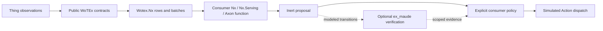

# Wotex Lab

**A consumer laboratory for connected Things and numerical experiments in Elixir / OTP.**

[](https://hex.pm/packages/wotex_lab)
[](https://hexdocs.pm/wotex_lab)
[](https://github.com/wotex-project/wotex-lab/actions/workflows/ci.yml)
[](https://codecov.io/gh/wotex-project/wotex-lab)
[](https://github.com/wotex-project/wotex-lab/blob/main/LICENSE)

WoTEx libraries describe, interact with, discover and exchange Thing values.
Lab composes their public seams into inspectable experiments. For the Nx
community, the entry point is a typed sensor observation becoming a numerical
batch, a model result and an inert Action proposal with traceable provenance.

This checkout supplies the library foundation, not the complete laboratory.
The [specification catalogue](docs/specs/catalogue.yaml) and
[completion contract](docs/plans/wotex-lab-completion.md) define the entire
accepted programme, including network adapters, dual Directory stores,
Livebooks, Nx.Serving/Axon experiments, formal verification, conformance, MCP,
PromEx/GreptimeDB/BeamLens, a lean LiveView workbench, hosted and embedded
distribution. Each has a concrete acceptance gate. None
is an unspecified backlog item or an advertised working feature.

## Run the foundation

Requires Elixir 1.18+ and OTP 27+. The source cohort was inspected on
2026-09-07; the WoTEx dependencies were not available from Hex at that time.
Use the same explicit development switch as the other libraries:

```sh
WOTEX_PATH_DEPS=1 mix setup
WOTEX_PATH_DEPS=1 mix run -e 'IO.inspect(Wotex.Lab.Examples.Thermal.run())'
WOTEX_PATH_DEPS=1 mix check --no-retry
```

Development expects `wotex` and `wotex-nx` checkouts alongside Lab. This mode is
local source evidence. It does not satisfy the clone-free acceptance gate.
The intended Hex dependency is `{:wotex_lab, "~> 0.1.0"}`; this README does not
claim that package is published. Production rejects `WOTEX_PATH_DEPS` and uses
Hex requirements. Publication and repository visibility are maintainer-owned.

```elixir
{:ok, result} = Wotex.Lab.Examples.Thermal.run()

result.encoded |> Wotex.Nx.Encoded.feature_order()
# => ["temperature"]

result.proposal
# => %Wotex.Nx.ActionProposal{action_name: "setTarget", input: 22.0, ...}
```

The example parses a checked-in TD, derives its temperature DataSchema, creates
two Kelvin observations, explicitly converts them to Celsius, encodes a lazy
`Nx.Batch`, runs a small `defn` through `Nx.Defn.Evaluator`, and decodes a bounded
proposal. It selects `Nx.BinaryBackend` only within the calling process and
restores that setting. No server, downloaded model, broker or Maude binary is
needed. The function is a transparent numerical baseline; it is not a trained
controller or evidence of prediction accuracy. Read
[`Thermal`](lib/wotex/lab/examples/thermal.ex) to see every public package call.

## Own the processes explicitly

```elixir
children = [
  {Wotex.Lab, id: "room-a", max_children: 32},
  {Wotex.Lab, id: "room-b", max_children: 32}
]

{:ok, supervisor} = Supervisor.start_link(children, strategy: :one_for_one)
Supervisor.which_children(supervisor)
```

Each Lab owns anonymous Thing and session DynamicSupervisors. Use the Lab PID
with `Wotex.Lab.start_child/3` to place trusted consumer child specs. Each role
has its own capacity. Explicit `:name` registration is supported; Lab creates
no names or atoms from input. Loading the Lab application starts no Lab process
(dependencies such as Nx retain their own application startup semantics).
There is no automatic scenario execution or plugin discovery.

```elixir
{:ok, scenario} = Wotex.Lab.Scenario.new(
  id: "thermal-nx", title: "Temperature to inert proposal",
  capabilities: ["nx.encode", "nx.evaluate", "nx.decode"],
  seed: 42, max_steps: 100
)

Wotex.Lab.Scenario.to_map(scenario)
```

Descriptors are data. The accepted execution contract assigns topology,
deadlines, faults, assertions and cleanup to an explicit runner, whose source
implementation is not part of this foundation.

## Architecture



Lab depends on the foundational libraries; they must never depend on Lab.
HTTP uses Req and explicit SSE lifecycle ownership; MQTT uses EMQTT and a
disposable broker; Directory uses independent ETS and SQLite implementations.
These are accepted reference choices, not mandatory dependencies of the base
library or implementations already supplied here. `ex_maude` earns a specific
place by exploring modeled conflicting control decisions and unsafe transition
orders. Its result cannot authorize an Action or certify a physical system.

## Workbench and metrics

The accepted UI is a lean Phoenix LiveView/HEEx workbench: a quiet sidebar,
focused experiment workspace, modest metric panels and an “Ask about this run”
composer. Livebook/Kino supplies the notebook path. The base
`Wotex.Lab.DesignSystem` already provides neutral, themeable tokens and scoped
CSS; a running endpoint and HEEx components are not built by this foundation.

| Concern | Selected reference |
| --- | --- |
| Custom metrics and dashboard definitions | Telemetry.Metrics + PromEx; Grafana exports, no required Grafana UI |
| Zero-service active history | Bounded in-BEAM ETS snapshots |
| Durable metrics | GreptimeDB, one local process or your existing service |
| Prompt-driven investigation | BeamLens with an explicit provider and read-only scoped query skill |
| Native UI | Phoenix LiveView/HEEx and shared semantic CSS tokens |

PromEx does not itself send metrics to GreptimeDB. The accepted host includes
a bounded BEAM self-scraper/remote-write bridge. No ELK, mandatory Prometheus
server or separate collector. GreptimeDB is local/self-hosted, not embedded in
the BEAM. Prompt results cite measurements and cannot invoke Actions. Plain
experiments work without an LLM or durable database. See
[metrics and AI](docs/specs/WLB.10-metrics-storage-and-ai-inspection.md) and
[workbench/design system](docs/specs/WLB.11-workbench-and-design-system.md) for
query budgets, isolation, privacy, components and acceptance tests.

## Source, evidence and adoption

| Axis | Meaning |
| --- | --- |
| `implementation_status` | `implemented`, `partial`, `planned`: source coverage of the entire spec |
| `evidence_status` | `missing`, `partial`, `complete`: coverage of its declared evidence obligations |
| `adoption_status` | `no_reference`, `reference_available`, `artifact_verified`: external consumption proof |

`planned` means an accepted contract with no implementation, not a deferred
milestone. The scenario runner and Nx programme are partial. The small OTP
foundation is implemented. No entry claims artifact verification. The
[source baseline](docs/provenance/standards-and-dependencies.md) records what
was actually inspected. Package publication, standards conformance, model
accuracy and stable API admission are separate claims.

`mix check` runs compilation, formatting, strict Credo, tests with 95% line
coverage, Doctor, Dialyzer, dependency audits, ExDoc, metadata checks and package
content inspection. That last check inspects an unpacked candidate; it does not
claim an independent archive consumer. See [WLB.08](docs/specs/WLB.08-distribution-and-compatibility.md)
for the stronger release gates.

## License

Apache-2.0. See [LICENSE](LICENSE) and [NOTICE](NOTICE). Maude is separately
licensed and never bundled or installed implicitly by this foundation.
